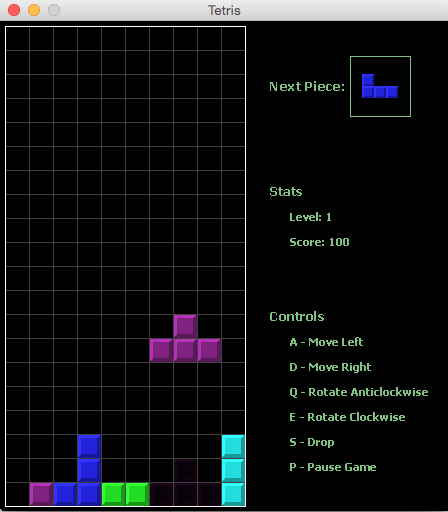

# Videogames JAVA

#### Proyecto: Tetris

Habilitar opciones de:

- [x] guardar
- [x] cargar
- [x] Uso de música de fondo
- [x] Sonido para cada vez que encaja una pieza se escuche
- [x] Animación de las piezas mientras caen (resplandecieran o algo asi)

La opcion de Cargar sera con una C y la de Guardar con una G, ambas deberán de aparecer del lado derecho.

#### Plus

- [x] Mute para canción
- [x] Sonido de stack de pieza y linea completa
- [x] Restart option

Criterio
-20 Estandar de codificación
-20 Animación de las piezas
-30 Opción de Guardado funciona perfecto
-30 Opcion de Cargado funciona perfecto
